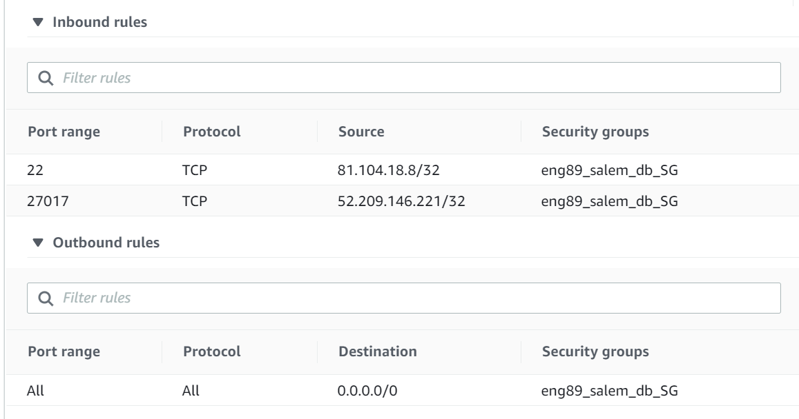

# two_tier_app_deployment

### Copying the Files to the App Machine
`scp -i "~/.ssh/eng89_devops.pem" -r "C:\Users\Sandstorm3\Desktop\New folder\db\" ubuntu@ec2-34-244-116-191.eu-west-1.compute.amazonaws.com:~/`
Use the command `mv` to rename the file if it names it to your windows directory.

### Set Up Reverse Proxy
Create a "default" file with no extension with the following code:
```
server {
  listen 80;

  server_name _;

  location / {
    proxy_pass http://{app_public_ip}:3000;
    proxy_http_version 1.1;
    proxy_set_header Upgrade $http_upgrade;
    proxy_set_header Connection 'upgrade';
    proxy_set_header Host $host;
    proxy_cache_bypass $http_upgrade;
  }
}
```
Replace or modify the default file at `/etc/nginx/sites-available/default` and run `sudo systemctl restart nginx` to load the changes.

### Create DB Machine
- Launch instance on AWS
- Select "Ubuntu Server 16.04 LTS (HVM), SSD Volume Type"
- Add a "Name" tag 
- On step 6 give a unique and descriptive SG name and set the following permissions:

- Launch and choose your key pair

### Connect Database
To connect the database to our nodeapp using MongoDB, you should run the following commands:
```
wget -qO - https://www.mongodb.org/static/pgp/server-3.2.asc | sudo apt-key add -
echo "deb http://repo.mongodb.org/apt/ubuntu xenial/mongodb-org/3.2 multiverse" | sudo tee /etc/apt/sources.list.d/mongodb-org-3.2.list
sudo apt-get update
sudo apt-get install -y mongodb-org=3.2.20 mongodb-org-server=3.2.20 mongodb-org-shell=3.2.20 mongodb-org-mongos=3.2.20 mongodb-org-tools=3.2.20
sudo chown -R mongodb:mongodb /var/lib/mongodb
sudo sed -i 's/127.0.0.1/0.0.0.0/g' /etc/mongod.conf
sudo systemctl enable mongod
sudo service mongod start
```

### Seeding
Head into the app machine and type in `node seeds/seed.js` when in the app folder. You can now start up the website with `npm start`.
